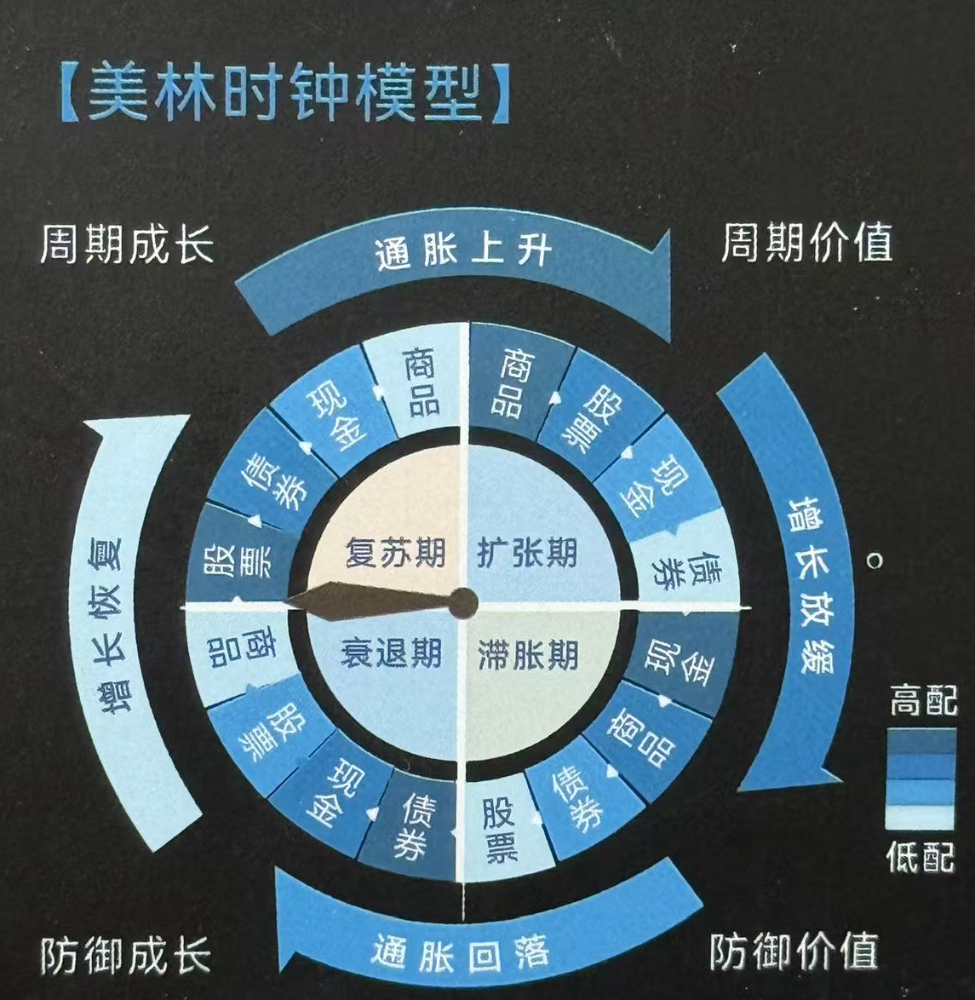
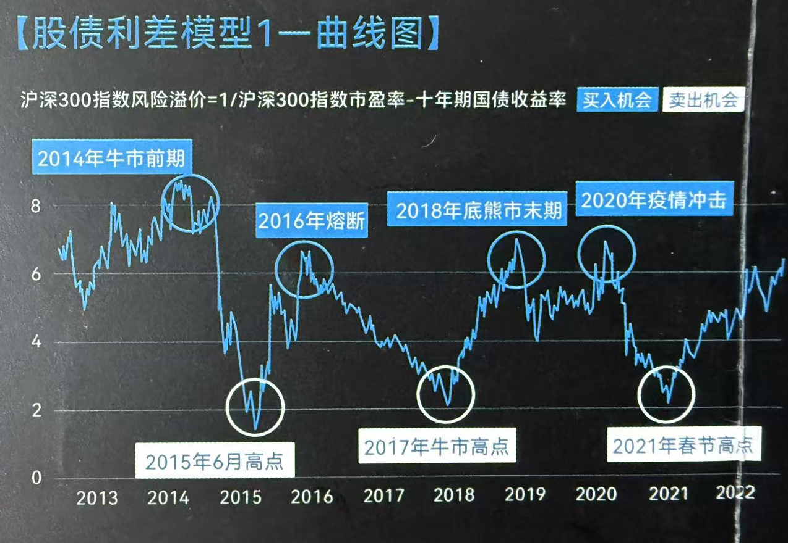
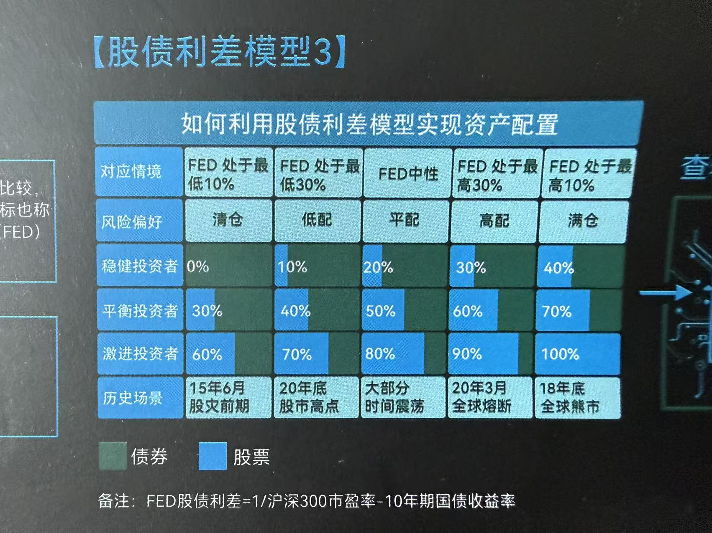

# 投资策略
解决如何买卖的问题

**Outline**
- 底层逻辑
- 战略资产配置
- 战术资产配置
- 止盈止损
- 定投攻略
- 长期投资

## 1. 底层逻辑

### 1.1 影响投资收益五大因素

影响重要程度依次增大
税费 -> 标的选择（基金组合是否优质） -> 交易成本（操作是否频繁） -> 资产配置与交易策略（是除投资者交易行为外，最重要的因素） -> 投资者行为（是否追涨杀跌等不理性操作）

### 1.2 投资策略三种分类方式

| 分类方式   | 策略名称     | 策略特点                        | 投资逻辑                                                                             | 优势                               | 劣势                     |
| ------ | -------- | --------------------------- | -------------------------------------------------------------------------------- | -------------------------------- | ---------------------- |
| 按照投资期限 | 长期策略     | 交易频率低                       | 主要依据估值和基本面分析，依靠股利贴现、自由现金流折现等模型判断标的投资价值                                           | 买点相对不重要，即使买在高点，也可以靠时间换空间弥补收益     | 需要较长的投资期限              |
| 按照投资期限 | 短期策略     | 交易频率高                       | 主要依据量化和技术面分析，通过股价走势形态、量价指标等判断标的投资价值                                              | 不需要太长的资金周期，哪怕持有时间段，也可以用胜率弥补赔率    | 需要严格的交易纪律              |
| 按照交易时机 | 左侧（逆向）投资 | 见底形态出现之前开始布局，见顶形态出现之前兑现获利   | 不关心什么时候出现底部，只要觉得股价合理、足够便宜，有足够的吸引力和安全边际，就选择买入。买入后如果下跌可能还会加仓，以拉低筹码成本               | 净值曲线相对平滑                         | 牛市后期往往提前减仓跑数大盘         |
| 按照交易时机 | 右侧（趋势）投资 | 向上趋势出现之后开始布局，触顶回落出现之后兑现获利   | 在底部形态出现以后买入，或者在顶部形态出现以后卖出。不追求买在最低点卖在最高点，只关注逻辑是否已经被验证                             | 净值曲线的弹性较大，牛市后期依然可以超越大盘           | 牛熊转换时，很可能因高仓位而比大盘跌的多   |
| 按照投资理念 | 自上而下     | 从宏观环境研究出发延伸到中观行业选择最终落实到基金选择 | 从宏观环境的变化除法（例如，市场趋势、基本面、资金面等顶层因素）进行大类资产比例的判断，然后再根据产业趋势和景气度等数据进行板块选择，最后再筛选出符合条件的基金 | 无需深入分析基金经理及管理的所有产品细节，指数基金即可满足需求  | 对宏观知识储备要求较高需实时跟踪中观行业变化 |
| 按照投资理念 | 自下而上     | 从单只基金研究出发扩展到中观行业配置最终延伸到宏观研究 | 从基金经理或具体基金的研究出发，利用定性调研和定量筛选，寻找优质的产品，再对相关的产品进行穿透分析从而做行业配比，最后再进行仓位和大类资产的比例选择       | 不需要宏观知识的储备，无需追踪中观行业变化，全权交由基金经理判断 | 需要深入分析基金经理及旗下不同产品的细节   |

### 1.3 基金中的不可能三角

收益高、风险（回撤）小、流动性好

### 1.4 战略战术分工和影响因素

在资产配置中，战略性资产负责大方向，如股债资产的配置中枢。战术性资产负责捕捉机会，如股债比例的增减配，行业风格的偏离度。

#### 1.4.1 战略级资产配置影响因素

- 投资者可投资资金的期限长度
- 投资者可以承受的波动、浮亏程度
- 组合中资产的种类及数量
- 投资者对投资收益率的期待水平

#### 1.4.2 战术级资产配置影响因素

资产配置解释了90%的收益波动

- 金融因素
  - 流动性水平
  - 信贷脉冲
  - 汇率变动等
- 经济因素
  - GDP增速
  - 通货膨胀率
  - 贸易开放度
  - 消费水平等
- 估值因素
  - 风险偏好
  - 景气度
  - 行业利润增速
  - ROE
  - 库存周期
- 政策因素
  - 货币政策
  - 财政政策
  - 产业政策

## 2. 战略资产配置

### 2.1 标普四笔钱模型

家庭资产配置象限

#### 2.1.1 短期消费的钱 - 需要保本

3-6个月的生活费，平时随时会用。不追求收益，更看重流动性和安全性。
工具：短期理财、货币基金、短债基金、信用卡等

#### 2.1.2 保命的钱 - 无需收益

解决家庭面临重大风险的支出
工具：意外险、医疗险、重疾险、寿险

#### 2.1.3 中期攒的钱 - 需要保值

半年到3年内暂时不会使用，但是有明确用途的钱，比如买车、旅游等不在短期流动性，注重安全与收益。不希望被通胀侵蚀。
工具：固收+类的基金和理财，或以债券基金为主的资产配置组合

#### 2.1.4 长期养老钱 - 需要增值

3年以上用不到的钱，为了养老，孩子上学的教育金长期攒的钱。希望能博得高收益。
工具：以股票基金为主所构建的长期资产配置组合

风险下滑曲线：**风险资产随生命周期模型（家庭形成期-成长期-成熟期-退休期）占比逐渐减小**

### 2.2 资产配置选品模型

#### 2.2.1 大类资产及证券风格选择

1. 股票、债券、现金
2. 大盘、小盘、中盘
3. 价值型、成长型、均衡型

#### 2.2.2 地区和国家选择

1. 亚洲、欧洲、拉美
2. 美国、中国、德国

#### 2.2.3 行业与证券选择

1. 科技、医疗、金融、消费等

#### 2.2.4 经理人选择

自主投资、基金经理、指数基金

#### 2.2.5 币种选择

1. 美元、欧元、英镑、日元等

#### 2.2.6 投资时机选择

1. 买入-持有
2. 逆向投资
3. 趋势投资

### 2.3 四种知名长期配置模型

#### 2.3.1 60/40恒定市值投资组合

按照资产价值确定股票与债券在投资组合中的权重，定期再平衡。
60%股票，40%债券

#### 2.3.2 风险均值投资组合（达利奥的全天候策略）

基于投资组合中资产的风险，而非资产价值占投资组合的比例来去定各类资产的权重。
40%长期债券、30%股票、15%短期固定收益、7.5%黄金、7.5%商品

#### 2.3.3 耶鲁捐赠基金（大卫·史文森的投资组合）

充分分散化、不仅在股市中分散，尽可能多投资不同风险源的产品，如实物资产、房地产、各类策略的私募基金等，并定期再平衡。
20%绝对收益、20%股票、20%风险投资、15%杠杆收购、10%房地产、10%固定收益/现金、5%大宗商品

#### 2.3.4 巴菲特建议的投资组合

巴菲特认为股票指数基金是最适合个人投资者的投资方式，并且认为美股是最好的股市投资市场。
90%标普500指数基金、10%现金

## 3. 战术资产配置

### 3.1 美林时钟模型

### 3.2 MVP模型

根据宏观经济运行周期，研判大类资产在不同阶段的表现
股市短期是投票器，长期是称重机
通过货币和信用研究，推演政策对股市的影响
宏观 Macro
估值 Valuation
政策 Policy

### 3.3 股债利差模型

1. 曲线图
   沪深300指数风险溢价=1/沪深300指数市盈率-十年期国债收益率
   
2. 什么是FED模型
   原理：股债性价比用股票的预期收益率和债券的收益率去比较，判断中长期股票更值得买还是债券更值得买。该指标也称为FED股债利差值或股债风险溢价，最早由美联储(FED)提出，对中长期资产配置有较好的指导意义。
   FED值
   \= 股票预期收益率 - 长期债券收益率
   \= 1/股票指数PE - 长期国债收益率
   \= 1/沪深300PE - 10年期国债收益率 （例）
3. 如何利用股债利差模型实现资产配置
   

### 3.4 贪婪恐惧模型

1. 股市的心理学
   （经典的追涨杀跌）
2. 指针图
   （借助工具，恐贪指数）
3. 有效性指示图
   市场阶段性顶部 - 贪婪值高，应警惕
   市场阶段性底部 - 恐惧值高，可买入

## 4. 止盈止损

### 4.1 止盈的四个方法

1. 盈利回落止盈
   比较适合激进投资者。基金短期涨势非常好，已经有了50%收益，还想再等等，看能不能涨到更高，后来没涨上去，收益率回落到40%，就止盈。
2. 指数估值止盈
   适合行业指数基金一级主题型的主动基金。观察基金投资板块的估值情况，如果与历史估值相比处于非常高的高点了，就去止盈。
3. 目标收益止盈

- 年化收益率止盈
  设定一个年化收益目标，比如5%，10%，达到收益目标后止盈。需要结合不同类型的基金，设置对应的目标。例如沪深300设置15%等
- 持有收益率止盈
  适合短期博弈。在一定时间内，持有收益达到目标，就止盈。一般用在持有1年以内的基金。

1. 高位止盈法
   当整体市场行情达到比较高估、亢奋的时候，准备止盈。通过股债性价比、恐贪指数等观察市场整体估值情况的指标。通常市场到了高点的时候，大概率会回落。

### 4.2 止损的四种情形

1. 突破纪律设置的最大回撤阈值
2. 基金所投行业基本面出现重大负面变化
3. 基金经理或基金公司出现重大负面舆情\
   基金经理变更时需要重新考虑当前基金的风险和收益。
4. 基金投资策略/风格出现重大变更不符合原计划

### 4.3 制定买卖交易策略四步法

1. 买入时机
   左侧交易：找准优质资产，如果资产价格低于合理价格，则越跌越买。在资产价格上涨之前的左侧购买。
   右侧交易：基于各类技术指标，只购买涨势得以确认的资产。不存在下跌过程中购买资产。
2. 买入频率
   定时定投：不进行判断市场的高低点，仅明确投资的周期，到了时间就买入
   择时定投：基于估值均线，价格涨跌等指标参考，在市场低估时多买，高估时少买。
   一次性买入：发现投资机会，单笔买入，一般适用于短线投资机会
3. 卖出时机
   目标收益率止盈
   收益回撤止盈
   市场指标止盈：如果为左侧交易，则利用各类估值指标，在判断市场高估时分批止盈。如果为右侧交易，则利用技术指标判断上涨趋势消失时止盈
4. 卖出频率
   一次性卖出：只设定一个止盈位置，达到后一次性止盈。
   分批卖出：设定多档位止盈的位置，分别达到对应的位置后，分档位分批止盈。

### 4.4 描述股市高低的七大指标

1. 指数估值分位点：指数的市盈率（PE）、市净率（PB）、市销率（PS）、股息率、市盈率相对盈利增长比率（PEG）等指标是用来描述股价相对基本面贵贱的指标。一般用上述指标的在历史的分位点，极当前估值水平在历史中的位置，来反应当前市场的估值情绪。
2. 股债性价比：也称格雷厄姆指标（比值法），FED指标（差值法），用股票的市盈率倒数反应股票的预期回报率，用十年期国债收益率反应债券收益率，两者比较反应股票相对债券的投资性价比。
3. 巴菲特指标：又称证券化率，为股票总市值 / 最近4个季度的GDP。巴菲特认为，若两者之间的比率处于70%至80%的区间之内，这时买进股票就会有不错的收益，但如果在这个比例偏高时买进股票，就等于在“玩火”。
4. 恐惧贪婪指数：由韭圈儿APP研发，描述整个股票市场情绪的综合指标，由众多描述市场情绪的单一指标整合而成。例如：50ETF期权波动率、北上资金买入成交额偏离度、股价强度（新高个股数占比）、股指期货升贴水率、股债回报差、融资买入成交额占比。
5. 行业情绪指标：由韭圈儿APP研发，描述行业板块短期市场情绪的指标，多由板块的成交额及成交价的趋势性技术指标构建。
6. 拥挤度：指定股票的总成交额 / A股全市场成交额 \* 100%。某板块拥挤度越高，表明该板块吸引力更多的资金，表明该板块短期的情绪越亢奋。
7. 破净率：衡量股票市场中股价跌破市净率个股的占比。在市场底部区域时，破净率会大幅上升，尤其是在市场见底前后。从历史市场底来看，破净率中值为12.02%。

### 4.6 网格交易
对ETF进行“高抛低吸”傻瓜式的交易策略。网格策略需要找不会跌没，同时波动较大的品种。

### 4.7 止盈止损口诀
核心持仓要均衡，长投不用止盈损。
交易持仓跟热点，止损止盈吃鱼身。
基金定投要坚持，止盈但是不止损。

## 5. 定投策略
### 5.1 定投五大特点
01 强制储蓄，积少成多
02 定额投资，低位布局
03 平滑成本，降低风险
04 省力省心，无需择时
05 门槛极低，轻松参与

### 5.2 适合定投的三大场景
1. 熊市期间，想抄底怕被埋
抄底后继续跌，定投快速回本
2. 牛市期间，想追高怕站岗
不小心站了岗，定投摊薄成本
3. 震荡市，想参与怕被套
基金净值没涨，定投已经赚钱

### 5.3 定投什么时候该止盈？
前中期，每一次定投都很重要。后期时刻准备止盈

### 5.4 智能定投之均线偏离法
净值高于均线时少投，低于均线时多投

## 6. 长期投资
投资越早越好，持有越久越好，红利再投资更好

